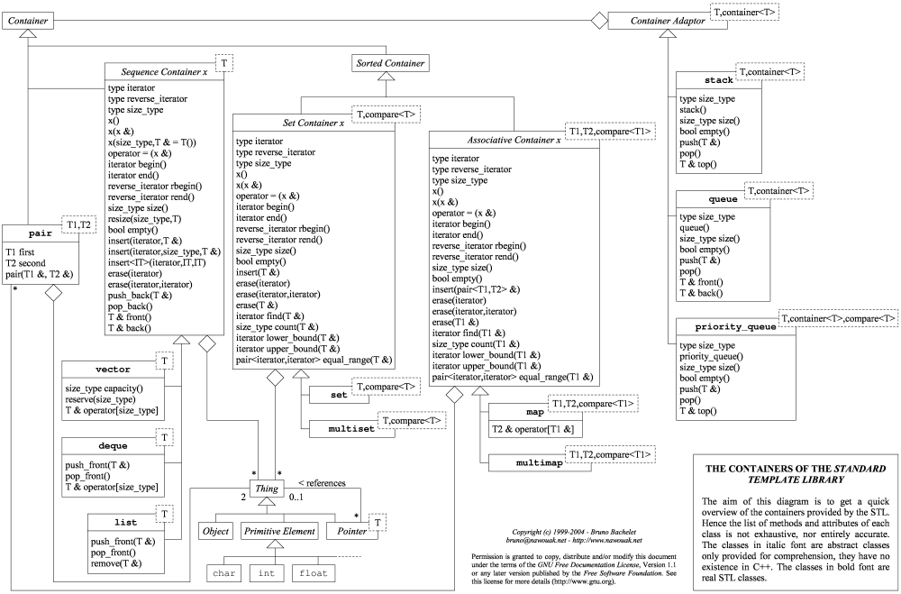

# s21_containers


Этот проект является частью учебного курса [Школы 21](https://21-school.ru/).

## Начало Работы

### Необходимые компоненты

Перед началом разработки, пожалуйста, установите следующие программы:

- [Git](https://git-scm.com/downloads)
- [Компилятор GCC](https://gcc.gnu.org/)
- [Утилита make](https://www.gnu.org/software/make/)

### Шаги установки и полезные команды

- Клонируйте [репозиторий](./)
- Запустите `make` - чтобы собрать проект и выполнить тесты
- `make check_style` - чтобы проверить исходный код на соответствие стилю Google
- `make leaks` / `make valgrind` - чтобы проверить проект на утечки памяти и корректный доступ к памяти

Если вы хотите использовать 's21_containers.h', не забудьте использовать пространство имён s21 перед контейнерами. <br /><br />
__Пример:__
```C++
s21::array<int, 5> arr = {1, 2, 3, 4, 5};
```

## Техническое задание

1. __Язык программирования и компилятор:__
- Программа реализована на C++17.
- Используйте компилятор GCC для компиляции.
2. __Организация кода:__
- Организуйте код программы внутри папки src.
3. __Стиль кодирования:__
- Следуйте рекомендациям по стилю кодирования Google для согласованности и читаемости.
4. __Пространство имён и шаблоны:__
- Реализуйте классы в пространстве имён s21.
- Используйте шаблонные классы для реализации контейнеров с поддержкой разных типов.
5. __Классы контейнеров:__
- Реализуйте классы контейнеров: list, map, queue, set, stack и vector.
- Предоставьте стандартные конструкторы (по умолчанию, копирования, перемещения, с использованием списка инициализации).
- Реализуйте методы для доступа, изменения и управления элементами контейнера.
- Включите методы для проверки, полон ли контейнер, или же он пуст.
6. __Итераторы:__
- Реализуйте итераторы для каждого класса контейнера.
- Предоставьте методы begin() и end() для доступа к итераторам.
- Реализуйте операции для итераторов: *iter, ++iter, --iter, iter1 == iter2, iter1 != iter2.
7. __Модульное тестирование:__
- Разработайте полное модульное тестирование с использованием библиотеки GTest.
- Обеспечьте покрытие тестами для всех методов контейнеров и крайних случаев.
8. __Логика STL и обработка исключений:__
- Следуйте логике библиотеки Standart Template Library ([STL](#standart-template-library-stl)) для проверок, обработки памяти и поведения в нестандартных ситуациях.
- Реализуйте соответствующую обработку исключений для ситуаций ошибок.
9. __Библиотека s21_containers.h:__
- Реализуйте заголовочный файл s21_containers.h.
- Создайте отдельные заголовочные файлы (например, s21_list.h, s21_map.h) для каждой реализации класса контейнера.
- Основывайтесь на классических парадигмах контейнеров, с возможностью выбора алгоритмов.
10. __Makefile:__
- Предоставьте Makefile для компиляции и тестирования библиотеки.
- Включите цели для очистки (clean) и тестирования (test).
11. __Библиотека s21_containers.h (Бонус):__
- Реализуйте заголовочный файл s21_containersplus.h для дополнительных классов контейнеров.
- Включите классы: array и multiset.
- Основывайтесь на классических парадигмах, позволяющих настройку алгоритмов.
12. __Метод insert_many (Бонус):__
- Расширьте классы контейнеров методом insert_many.
- Реализуйте варианты метода для разных контейнеров.
- Поддерживайте разное количество параметров с использованием механизма пакетных параметров.

## Standart Template Library (STL)


